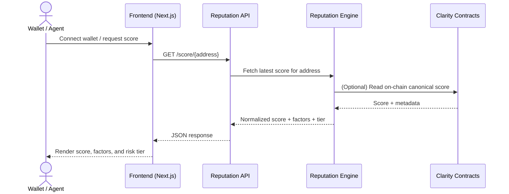

## BitTrust

[](LICENSE)
[](https://www.stacks.co/)

**BitTrust** is a decentralized reputation protocol for the Bitcoin ecosystem, built on Stacks.  
It analyzes on-chain activity and produces verifiable reputation scores that wallets, AI agents, and protocols can use to make risk-aware decisions before transferring value or executing contracts.

---

## Overview

**Problem**  
Modern DeFi and agentic systems routinely interact with unknown wallets. Without a shared reputation layer:

- Malicious wallets can repeatedly scam users.
- AI agents cannot reliably select trusted counterparties.
- Under-collateralized lending is hard to price.
- Sybil-resistant governance remains difficult.

**Solution**  
BitTrust provides an **on-chain reputation oracle** for Bitcoin ecosystems (via Stacks):

- Indexes wallet activity and protocol interactions.
- Computes a normalized trust score in \[0, 100\].
- Anchors scores on-chain for transparency and composability.
- Exposes scores via a query API and on-chain read paths.

---

## System Architecture

At a high level, BitTrust is composed of:

- **Frontend (`frontend/`)**: Next.js 16 app (App Router) for wallet connection, score visualization, and operator dashboards.
- **Reputation Engine (off-chain service, WIP)**: Indexes blockchain data, applies the scoring model, and persists derived scores.
- **Indexing Layer (WIP)**: Connectors to Stacks/BTC data sources (indexer nodes, explorers, or custom ETL).
- **Smart Contracts (planned `contracts/`)**: Clarity contracts to store scores, verify payments, and expose a canonical on-chain view.
- **Blockchain Layer**: Stacks as the execution and data anchoring layer, settling to Bitcoin.

**High‑level component diagram**

```mermaid
flowchart LR
  subgraph Client
    U[User Wallet / AI Agent]
    FE[BitTrust Frontend (Next.js)]
  end

  subgraph OffChain[Off‑chain Services]
    IDX[Indexing Layer]
    RE[Reputation Engine]
    API[Public / Internal API]
  end

  subgraph OnChain[Stacks / Bitcoin]
    SC[BitTrust Clarity Contracts]
    BTC[Bitcoin Settlement]
  end

  U --> FE
  FE --> API
  IDX --> RE
  RE --> SC
  SC --> BTC
  API --> RE
  FE --> SC
```

**Data flow (target design)**

1. Indexer ingests wallet activity (tx history, DeFi interactions, governance actions).
2. Reputation engine normalizes features and computes a score per wallet.
3. Scores are periodically committed on-chain via BitTrust contracts.
4. Frontend and external agents query scores via:
   - Off-chain HTTP API (for low-latency reads and analytics).
   - On-chain read-only contract calls (for protocol-level integration).

---

## System Flow (End‑to‑End)

The following sequence diagram summarizes a typical score lookup:



---

## Reputation Model

BitTrust’s scoring model is designed to be explainable and composable. Example dimensions:

- **Wallet age & stability** – time since first on-chain activity and inactivity gaps.
- **Transaction quality** – success/failure rates, reverts, and gas griefing patterns.
- **DeFi performance** – repayment history, liquidation frequency, and collateralization behavior.
- **Protocol surface** – interactions with known-good / known-bad contracts.
- **Governance & community** – voting participation, proposal history, and sybil patterns.

Scores are mapped into coarse **trust tiers** for easier integration:

| Score      | Trust Level      |
|-----------:|------------------|
| 0–30       | High Risk        |
| 31–60      | Medium Risk      |
| 61–80      | Trusted          |
| 81–100     | Highly Trusted   |

Downstream protocols can set their own thresholds and capital limits per tier.

---

## Frontend Application

The primary UI lives in `frontend/`:

- **Framework**: Next.js 16 (App Router) + React 18.
- **Styling**: Tailwind CSS with a dark, dashboard-style design.
- **Components**: Scores, factor breakdowns, history tables, and architecture diagrams.
- **Wallet Integration**: Stacks wallet connection for identifying the current user wallet.

Local development:

```bash
cd frontend
npm install
npm run dev
```

The app will be served on the default Next.js dev port (typically `http://localhost:3000`).

---

## Backend & Contracts (Planned)

The current repository is **frontend-heavy**; backend services and contracts are being iterated on.  
Target responsibilities:

- **Reputation Engine**
  - Ingest on-chain events and off-chain context where available.
  - Compute scores and explanations (per-factor contributions).
  - Expose an internal API for frontend and public API gateway.

- **Smart Contracts (Clarity)**
  - Store the canonical reputation score per wallet.
  - Gate write access to authorized reputation engines / DAOs.
  - Optionally couple reads to payment flows (x402-style pay-to-read).

---

## Deployment

- **Frontend**: Optimized for deployment on Vercel (Next.js) or similar platforms.
- **Backend / Engine**: Intended for containerized deployment (Docker/Kubernetes) behind an API gateway.
- **Contracts**: Deployed to Stacks mainnet/testnet, with configuration surfaced via environment variables or a small registry contract.

High-level concerns:

- Clear separation between **read** and **write** paths for reputation data.
- Idempotent scoring jobs to safely re-run indexing and recomputation.
- Versioned scoring models so downstream consumers can reason about upgrades.

---

## Technology Stack

- **Frontend**: Next.js 16, React 18, Tailwind CSS, Radix UI, Recharts.
- **Blockchain**: Stacks smart contracts (Clarity), settling to Bitcoin.
- **Language / Tooling**: TypeScript, ESLint, Turbopack build pipeline.
- **Planned Infra**: Containerized services, background workers for indexing and scoring.

---

## Local Development Summary

- **Start frontend**: `cd frontend && npm run dev`
- **Type-check**: `cd frontend && npx tsc --noEmit`
- **Build for production**: `cd frontend && npm run build`

Backend and contract commands will be documented alongside their implementations as those components are added to this repo.

---

## Roadmap

- Implement and document the first on-chain BitTrust contracts (payment + reputation registry).
- Ship the initial reputation engine and indexing pipeline.
- Add public score query APIs (HTTP + on-chain) with rate limiting and pricing.
- Introduce richer analytics (leaderboards, cohort analysis, anomaly detection).
- Formalize governance and model upgrade mechanisms.

---

## License

This project is licensed under the MIT License. See the [`LICENSE`](LICENSE) file for details.
